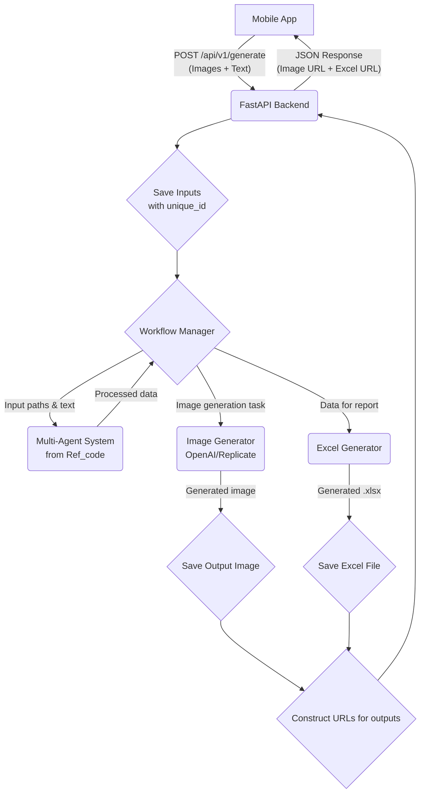

# Production-Ready Fashion Modeling AI System Plan

## 1. Project Overview

The project aims to build a robust Python backend API for a fashion modeling AI system. The API will be consumed by a mobile application. It will accept multiple images and a text description, process them through a multi-agent AI workflow, generate a final composite image, and compile relevant data into an Excel report. The system needs to be scalable, maintainable, and production-ready.

## 2. Technology Stack

- **Backend Framework**: FastAPI (for its high performance, async capabilities, and automatic OpenAPI documentation)
- **Image Processing**: Pillow (PIL)
- **Excel Generation**: `openpyxl` or `pandas`
- **AI/ML Models**:
  - OpenAI API (for tasks like image analysis or text processing)
  - Replicate API (for running specific image generation models)
  - The multi-agent logic from `Ref_code/multiagent_system.py` and `Ref_code/workflow.py` will be integrated.
- **Data Validation**: Pydantic (comes with FastAPI)
- **Dependency Management**: `pip` with `requirements.txt`.
- **Web Server**: Uvicorn with Gunicorn for production.
- **File Storage**: Local file system for development, with a design that allows plugging in cloud storage (like AWS S3) for production.

## 3. Project Structure

A clean and scalable project structure will be established.

```
FashionModelingAI/
├── .gitignore
├── app/
│   ├── __init__.py
│   ├── main.py             # FastAPI app initialization and endpoint definitions
│   ├── schemas.py          # Pydantic schemas for request/response validation
│   ├── crud.py             # Business logic and data manipulation
│   ├── core/
│   │   ├── __init__.py
│   │   ├── config.py         # Configuration management (e.g., API keys)
│   │   └── security.py       # API key validation, etc.
│   ├── api/
│   │   ├── __init__.py
│   │   └── v1/
│   │       ├── __init__.py
│   │       └── endpoints/
│   │           ├── __init__.py
│   │           └── generate.py   # The main generation endpoint logic
│   ├── services/
│   │   ├── __init__.py
│   │   ├── image_generator.py # Logic for interacting with OpenAI/Replicate
│   │   ├── excel_generator.py # Logic for creating the Excel file
│   │   └── workflow_manager.py # Integration of the multi-agent workflow from Ref_code
│   └── utils/
│       ├── __init__.py
│       └── file_helpers.py   # Utility functions for file operations
├── Ref_code/               # Reference code (will be refactored into `app/`)
├── generated_files/        # Directory to store output images and Excel files
│   ├── images/
│   └── excels/
├── requirements.txt
├── README.md
└── plan.md
```

## 4. API Endpoint Design

A single main endpoint will handle the generation requests.

- **Endpoint**: `/api/v1/generate`
- **Method**: `POST`
- **Request**: `multipart/form-data`
  - `images`: A list of uploaded image files. FastAPI can handle `List[UploadFile]`.
  - `text`: A string field containing the user's text input.
- **Response**: `JSON`
  - On success (HTTP 200):
    ```json
    {
      "output_image_url": "url/to/generated/image.jpg",
      "excel_report_url": "url/to/generated/report.xlsx",
      "request_id": "unique_request_id"
    }
    ```
  - On failure (e.g., HTTP 400, 500):
    ```json
    {
      "detail": "Error message explaining what went wrong."
    }
    ```

## 5. Core Logic Implementation

The core of the application will be in processing the inputs and generating outputs.

1.  **Input Handling (`app/api/v1/endpoints/generate.py`)**:

    - The endpoint will receive images and text.
    - It will generate a unique `request_id` for tracking.
    - Input files will be saved to a temporary directory within `generated_files/` corresponding to the `request_id`.

2.  **Workflow Management (`app/services/workflow_manager.py`)**:

    - This service will orchestrate the main business logic.
    - It will adapt and integrate the logic from `Ref_code/workflow.py` and `Ref_code/multiagent_system.py`.
    - It will take the paths to the input images and the text as input.
    - It will call other services (like `image_generator`) as needed.
    - The output will be the data needed for the final image and the Excel report.

3.  **Image Generation (`app/services/image_generator.py`)**:

    - This service will be responsible for creating the final output image.
    - It will contain functions to call the OpenAI DALL-E or Replicate APIs, based on the logic from `Ref_code/test_openai_image.py` and `Ref_code/test_replicate.py`.
    - The generated image will be saved to `generated_files/images/`.

4.  **Excel Generation (`app/services/excel_generator.py`)**:
    - This service will create the Excel file.
    - It will receive structured data (e.g., a dictionary or a list of objects) from the `workflow_manager`.
    - Using `openpyxl` or `pandas`, it will create a `.xlsx` file with the provided data, including metadata and any specified fields.
    - The file will be saved to `generated_files/excels/`.

## 6. Data Flow



## 7. File Management

- **Input Files**: Uploaded images will be temporarily stored in a per-request directory (e.g., `generated_files/temp/<request_id>/`). This directory will be cleaned up after the request is complete.
- **Output Files**: Generated images and Excel files will be stored in `generated_files/images/` and `generated_files/excels/`. Filenames should be unique, possibly using the `request_id`.
- **Serving Files**: FastAPI will be configured to serve the `generated_files` directory as static files, allowing the mobile app to download the outputs from the provided URLs. For production, a dedicated file server or cloud storage is recommended.

## 8. Error Handling and Logging

- **Error Handling**: Use FastAPI's exception handling mechanisms to catch and return meaningful error messages. Custom exceptions will be defined for different failure scenarios (e.g., AI model failure, file processing error).
- **Logging**: Implement structured logging (e.g., using Python's `logging` module) to record key events, errors, and request details. This will be crucial for debugging and monitoring.

## 9. Deployment Considerations

- **Environment Variables**: All sensitive information (API keys, etc.) will be managed through environment variables, not hardcoded. The `app/core/config.py` will handle this.
- **Containerization**: The application will be containerized using Docker for portability and ease of deployment. A `Dockerfile` will be created.
- **Production Server**: Use Gunicorn as the application server to manage multiple Uvicorn workers, ensuring the application can handle concurrent requests.

## 10. Development Tasks (Roadmap)

1.  [ ] **Phase 1: Project Setup**

    - [ ] Initialize project directory structure.
    - [ ] Set up a virtual environment and install initial dependencies (FastAPI, Uvicorn).
    - [ ] Create `requirements.txt`.
    - [ ] Create a basic "Hello World" FastAPI app in `app/main.py` to ensure setup is correct.
    - [ ] Initialize Git repository and add `.gitignore`.

2.  [ ] **Phase 2: API Endpoint and File Handling**

    - [ ] Implement the `/api/v1/generate` endpoint in `app/api/v1/endpoints/generate.py`.
    - [ ] Handle `multipart/form-data` to accept multiple images and text.
    - [ ] Implement logic to save uploaded files to a temporary location.
    - [ ] Set up static file serving for the `generated_files` directory.
    - [ ] Return placeholder URLs in the JSON response.

3.  [ ] **Phase 3: Core Logic Integration**

    - [ ] Refactor and integrate `Ref_code/setup_environment.py` logic into `app/core/config.py` for managing API keys.
    - [ ] Adapt the core logic from `Ref_code/workflow.py` and `Ref_code/multiagent_system.py` into `app/services/workflow_manager.py`.
    - [ ] Create the `app/services/image_generator.py` service, integrating code from `test_openai_image.py` and `test_replicate.py`.
    - [ ] Create the `app/services/excel_generator.py` service.
    - [ ] Wire up the services in the `generate.py` endpoint.

4.  [ ] **Phase 4: Finalization and Polish**
    - [ ] Implement robust error handling and logging.
    - [ ] Write unit and integration tests for key components.
    - [ ] Create `Dockerfile` for containerization.
    - [ ] Write `README.md` with setup and usage instructions.
    - [ ] Perform a final code review and cleanup.
